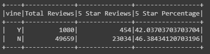

# Amazon Vine Analysis
## Overview 
The purpose of this analysis was to utilize postgreSQL, pyspark, and AWS to conduct an analysis of Amazon Reviews. After selecting to do the analysis on the Electronics data sheet and cleaning it, the goal was to see if there was any bias effecting the quality of reviews when comparing them from people who are involved in the Amazon Vine Program, versus those who are not. 

## Results 
After filtering the available reviews to customers who had recieved at least 20 votes and had over 50% percent of those votes marked helpful, we calculated:
- The total number of reviews for all Vine and non-Vine customers.
- The number of 5 star reviews by Vine and non-Vine customers.
- Percentage of 5-star reviews by total reviews for all Vine and non-Vine customers.

Included below is a table showing these results.

 

- Of the total 50,739 reviews, only 2.13% (1080) of them were paid Vine Program reviewers. 

## Summary 
After analysis of the results, it can be concluded that there is no support of positivity bias from reviews in the Vine program. People in this program had a lower percentage chance to give a 5 star review, 42.0%, when compared to the normal reviewee, 46.4%. If anything, one could suggest that the Vine program reviewers give a fair unbiased review to the products that they are writing about and that their reviews can be taken into consideration without fear of biasedness. 

To strengthen our conclusion and this analysis, the reviews from several other product categories should be analyzed and compared to this one.
